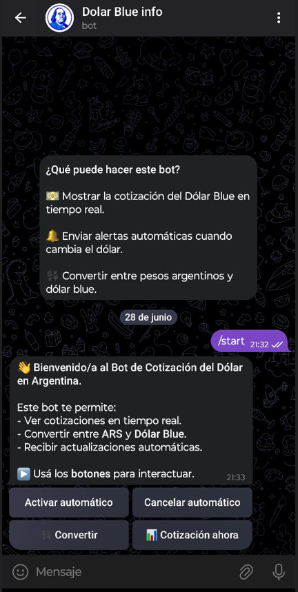
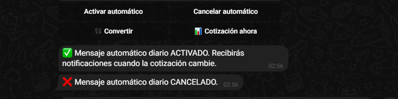
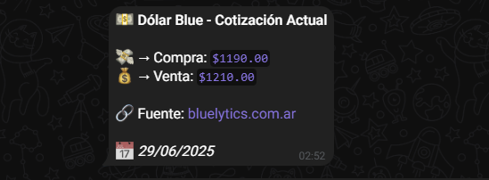
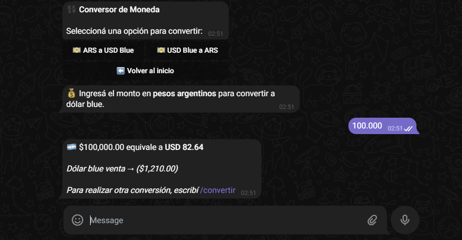

# 🤖 Dolar Blue Bot — Cotización del dólar en Telegram 🇦🇷

Un bot simple de Telegram para consultar el valor del dólar blue. También podés activar alertas para que te avise automáticamente cuando cambie el precio.

📲 [@DolarBlueInfo_Bot](https://t.me/DolarBlueInfo_Bot)
  


---

## 💡 ¿Qué hace?

- 📈 Muestra el valor del dólar blue
- 🔔 Envía alertas cuando el precio cambia (si activás las notificaciones)
- 💾 Guarda tus preferencias en una base de datos
- ☁️ Funciona 24/7 gratis en [Render.com](https://render.com)

---

## 🌐 Fuente de datos

La cotización del dólar se obtiene de la API pública de Bluelytics (Argentina):  
📡 https://api.bluelytics.com.ar/v2/latest

---

## 📦 Paquetes NuGet necesarios

```xml
<ItemGroup>
  <!-- Base de datos SQLite -->
  <PackageReference Include="Microsoft.EntityFrameworkCore.Sqlite" Version="9.0.6" />
  <PackageReference Include="Microsoft.EntityFrameworkCore.Design" Version="9.0.6" />
  <PackageReference Include="Microsoft.EntityFrameworkCore.Tools" Version="9.0.6" />

  <!-- Cliente para Telegram -->
  <PackageReference Include="Telegram.Bot" Version="22.5.1" />
</ItemGroup>
```

### 🛠️ Cómo agregarlos:

**Opción 1 - Manual**  
1. Abrí `BotCotizacionWeb.csproj`  
2. Pegá los paquetes dentro de `<ItemGroup>`  
3. Guardá los cambios

**Opción 2 - Terminal**
```bash
dotnet add package Microsoft.EntityFrameworkCore.Sqlite --version 9.0.6
dotnet add package Microsoft.EntityFrameworkCore.Design --version 9.0.6
dotnet add package Microsoft.EntityFrameworkCore.Tools --version 9.0.6
dotnet add package Telegram.Bot --version 22.5.1
```

---

## 📂 Estructura del proyecto

```
dolar-hoy-bot/
├── BotCotizacionWeb/       # Código principal del bot
│   ├── Program.cs          # Punto de entrada
│   ├── CotizacionService.cs # Lógica para obtener precios del dólar
│   ├── Data/
│   │   └── AppDbContext.cs # Configuración de la base de datos
│   └── ...
└── README.md
```

---

## 🔧 Requisitos

- ✅ [.NET 8 SDK](https://dotnet.microsoft.com/en-us/download)
- ✅ Cuenta gratuita en [Render.com](https://render.com)
- ✅ Token de Telegram (usá [@BotFather](https://t.me/BotFather))

---

## 🧪 ¿Cómo probarlo localmente?

1. Cloná el repo:
```bash
git clone https://github.com/maurocosentino/dolar-hoy-bot.git
cd dolar-hoy-bot
```

2. Creá `appsettings.Development.json` dentro de `BotCotizacionWeb`:
```json
{
  "Telegram": {
    "BotToken": "TU_TOKEN"
  }
}
```

3. Ejecutá la migración de la base de datos:
```bash
dotnet ef database update -p BotCotizacionWeb
```

4. Iniciá el bot:
```bash
dotnet run --project BotCotizacionWeb
```

---

## 🚀 Despliegue en Render

1. Subí tu proyecto a GitHub  
2. Entrá a [Render.com](https://render.com) y creá un nuevo **Web Service**  
3. Configurá:

```
Build Command: dotnet build
Start Command: dotnet BotCotizacionWeb.dll
```

4. Agregá la variable de entorno:
```
BOT_TOKEN=TU_TOKEN
```

¡Listo! El bot va a ejecutarse automáticamente.

---

## ⏳ Mantenerlo activo todo el día (gratis)

Render puede pausar servicios gratuitos si no se usan. Para evitarlo:

- El bot tiene una ruta especial: `/ping`
- Usá [UptimeRobot](https://uptimerobot.com) (gratis) para "pinguear" esa ruta cada 10 minutos

Así el bot se mantiene activo sin dormir 😴

---

## 💬 ¿Cómo recibe mensajes?

- Escucha mensajes constantemente (polling)
- **No** usa webhooks
- ⚠️ Solo una instancia debe estar activa (local o en Render, no ambas)

---

## 🧠 Comandos del Bot y Funcionalidades

| Comando / Acción        | Función                                                                 |
|-------------------------|-------------------------------------------------------------------------|
| `/start`                | Muestra un mensaje de bienvenida con los botones interactivos.         |
| `/dolar`                | Muestra la cotización actual del dólar blue.                 |
| `/activar`              | Activa alertas automáticas si cambia la cotización.                   |
| `/cancelar`             | Desactiva el envío automático de alertas.                              |
| 🔘 `Activar automático` | (Botón) Equivale a `/activar`.                                         |
| 🔘 `Cancelar automático`| (Botón) Equivale a `/cancelar`.                                        |
| 🔘 `Cotización ahora`   | (Botón) Muestra la cotización actual.                                  |
| 🔘 `Inicio`             | (Botón) Muestra todos los botones principales.                         |

> Todos los botones usan `callback_data`, por lo que no hace falta que el usuario escriba comandos manualmente.

---

## ⚠️ Tips útiles

- Si no funciona localmente, asegurate de que la instancia en Render esté detenida
- Render en su plan gratuito tiene límites de CPU, RAM y tráfico

---

## 🖼️ Capturas de pantalla

### 1. Inicio del bot


### 2. Activar/Desactivar mensaje automático


### 3. Cotización actual del dólar blue


### 4. Conversor de Moneda /convertir 


---

## 📄 Licencia

Este proyecto está bajo la licencia MIT.  
Ver [LICENSE](./LICENSE) para más información.

---

## 🤝 Contribuciones

¡Pull requests y sugerencias son bienvenidas!  
Este bot es libre y puede ayudarte a empezar con proyectos similares.